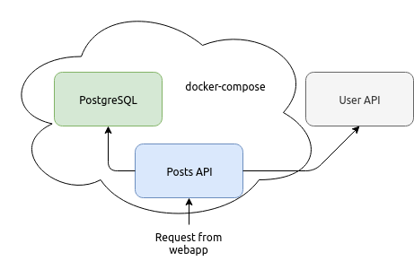

# lne-posts

The purpose of this micro-service is to provide a list of posts and comments.
Any user can post and comment.

## API endpoints

Available via the `npm run gen-doc` command and opening the file `./apidoc/index.html`.

## CI/CD

A Github action workflow is present in the project that allows to build and deploy the service after each push on the master branch.

## Architecture

## Deploy

This api has a docker image (published on [Docker hub](https://hub.docker.com/repository/docker/nouvelle0epoch/lne-posts)).
To run it, you only need to install docker.
A `docker-compose.yml` file is provided to simplify the deployment.

## Local deployment

To start the server locally you need to have Postgresql installed and create an user named `lne_user`.
To setup the database you need to execute the following commands
1. `psql -U postgres -f docker-entrypoint-initdb.d/scripts/db.pgsql`
2. `bash docker-entrypoint-initdb.d/1-create-schema.sh`
3. `bash docker-entrypoint-initdb.d/2-create-tables.sh`
4. `bash docker-entrypoint-initdb.d/3-create-triggers.sh`

To install dependencies use the `npm install` command
To build the service use the `npm run build` command
To start the service use the `npm start` command
